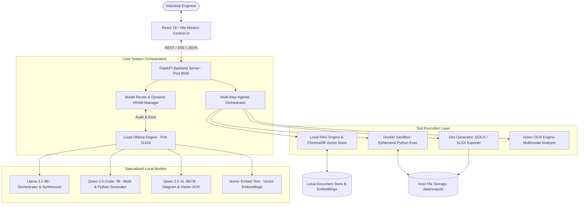

# V.A.U.L.T. — Sovereign On-Premise Agentic AI Workbench

<p align="center">
  <strong>100% Local, Air-Gapped, Hardware-Optimized Agentic AI System for Industrial Operations</strong>
  <br />
  <em>Built for MRPL (Mangalore Refinery and Petrochemicals Limited) • SIH Problem Statement 26117</em>
</p>

```bash
# ⚡ Quick Command Cheat Sheet
python setup.py          # 1. Full interactive setup
python setup.py --auto   # 2. Non-interactive automated setup
python setup.py --check  # 3. System & environment diagnostics check
python setup.py --models # 4. Pull required Ollama AI models
python setup.py --sandbox# 5. Build Docker code sandbox image
python setup.py start    # 6. Launch both Backend & Frontend simultaneously
```

<p align="center">
  
  
  
  
  
  
  
</p>

---

## 📖 Table of Contents
1. [Executive Summary](#-executive-summary)
2. [Key Capabilities](#-key-capabilities)
3. [System Architecture](#-system-architecture)
4. [Hardware & Model Strategy (6GB VRAM)](#-hardware--model-strategy-6gb-vram)
5. [Prerequisites](#-prerequisites)
6. [Quick Start (Automated Setup)](#-quick-start-automated-setup)
7. [Manual Installation & Setup](#-manual-installation--setup)
8. [Interactive Workflow & Feature Guide](#-interactive-workflow--feature-guide)
9. [API Reference](#-api-reference)
10. [Directory Structure](#-directory-structure)
11. [Troubleshooting & FAQs](#-troubleshooting--faqs)
12. [License](#-license)

---

## 🛡️ Executive Summary

Industrial environments like oil refineries, chemical plants, and heavy manufacturing facilities require deep technical assistance for SOP compliance, engineering calculations, P&ID diagram inspection, and formal approval generation. However, **enterprise data privacy and national infrastructure security strictly forbid sending proprietary schematics and telemetry to public cloud APIs.**

**Project V.A.U.L.T. (Verified Agentic Unified Local Taskforce)** is a sovereign, self-contained AI workbench engineered from the ground up for strict air-gapped deployment:
- **Zero Cloud Dependence**: Runs 100% locally via on-premise hardware using Ollama and persistent ChromaDB.
- **Dynamic VRAM Manager**: Employs an aggressive memory eviction pipeline allowing complex multi-model workflows (Orchestrator + Coder + Vision + Embeddings) on constrained edge GPUs (e.g., NVIDIA RTX 3050 6GB).
- **Industrial Safety & Isolation**: Executes untrusted or agent-generated Python scripts inside an air-gapped, resource-capped Docker sandbox.
- **Enterprise Asset Generation**: Produces formatted `.docx` MRPL Approval Notes and `.xlsx` calculation sheets ready for supervisory review.

---

## 🚀 Key Capabilities

```
┌─────────────────────────────────────────────────────────────────────────────┐
│                            V.A.U.L.T. ENGINE                                │
├────────────────────────┬──────────────────────────┬─────────────────────────┤
│  🧠 Plan-and-Execute   │  👁️ Industrial Vision    │  📊 Code Sandbox & RAG  │
│  Multi-step agent with │  P&ID diagram parsing,   │  Air-gapped Docker      │
│  live step reflection  │  gauge OCR, schematic    │  container + ChromaDB   │
│  and tool dispatching  │  inspection (Qwen2.5-VL) │  vector semantic search │
├────────────────────────┼──────────────────────────┼─────────────────────────┤
│  📝 MRPL Doc Generator │  ⚡ VRAM Auto-Eviction   │  🖥️ Mission Control UI  │
│  Direct .docx and .xlsx│  Zero OOMs on 6GB VRAM   │  Real-time telemetry,   │
│  industrial exports    │  through active swap     │  chat history, uploads  │
└────────────────────────┴──────────────────────────┴─────────────────────────┘
```

1. **Intelligent Model Routing & VRAM Control**
   - Automatically determines whether a query is conversational, analytical/mathematical, or visual.
   - Audits GPU memory in real time and evicts unneeded models before loading target weights.
2. **Industrial Multimodal Vision & OCR**
   - Analyzes technical Piping and Instrumentation Diagrams (P&IDs), valve tags, analog dials, electrical schematics, and scanned inspection logs.
   - Built-in downscaling and padding normalization protects against CUDA Out-of-Memory (OOM) errors.
3. **ChromaDB-Powered Industrial RAG**
   - Automatically ingests, parses, chunks, and indexes PDFs, DOCX, XLSX, and TXT files using local embeddings (`nomic-embed-text`).
   - Retrieves relevant SOP passages and specifications with cosine-distance semantic search.
4. **Isolated Docker Code Sandbox**
   - Executes Python math and data science routines in an ephemeral, networkless container (`vault-sandbox:latest`).
   - Bound with strict memory (256MB) and CPU quotas (50% of single core), mapping outputs directly to the host filesystem.
5. **Standardized Industrial Documentation**
   - Outputs official MRPL-style Approval Notes with approval tables, department tags, and reference tracking.
   - Exports calculation workbooks with metadata sheets and structured result columns.

---

## 🏗️ System Architecture



---

## 🎯 Hardware & Model Strategy (6GB VRAM)

To deliver sovereign AI capabilities on edge workstations without expensive data-center GPUs, V.A.U.L.T. uses a sequential **hot-swapping model roster**:

| Model Tag | Primary Role | Size on Disk | Active VRAM Footprint |
| :--- | :--- | :--- | :--- |
| **`llama3.1:8b`** | Primary Orchestrator, Reasoning, Synthesis | ~4.7 GB | ~5.0 GB |
| **`qwen2.5-coder:7b`** | Script Generation, Formula Solving, Dataframe Processing | ~4.7 GB | ~4.9 GB |
| **`qwen2.5vl:3b`** | Industrial Vision OCR, P&ID Diagram Inspection (Fast Default) | ~2.2 GB | ~2.9 GB |
| **`qwen2.5vl:7b`** *(Optional)* | Precision Deep Vision Inspection (High-detail diagrams) | ~5.5 GB | ~5.8 GB |
| **`nomic-embed-text`** | ChromaDB Semantic Embeddings (Air-gapped) | ~274 MB | Minimal (Shared) |

> [!IMPORTANT]
> **VRAM Management Policy**: The orchestrator checks `/api/ps` on the local Ollama daemon before each step. If a different model is in memory, it forcefully unloads the idle model (`keep_alive: 0`) and triggers a PCIe bus flush before allocating memory for the incoming model.

---

## ⚙️ Prerequisites

Before installing, ensure your host environment meets the following baseline requirements:

- **Operating System**: Windows 10/11 (64-bit) or Linux (Ubuntu 20.04+)
- **Python**: `3.10` or `3.11` (Python 3.11+ recommended)
- **Node.js**: `18.x` or `20.x`+ (with `npm`)
- **Ollama**: Installed and accessible in PATH ([Download Ollama](https://ollama.ai))
- **Docker**: Docker Desktop (Windows) or Docker Engine (Linux) for sandbox execution
- **GPU (Recommended)**: NVIDIA GeForce RTX 3050 (6GB) / RTX 3060 / RTX 4060 or higher with CUDA support. *(CPU mode works with reduced inference speed).*

---

## ⚡ Quick Start (Automated Setup)

V.A.U.L.T. includes an all-in-one automation script: [setup.py](file:///d:/V.A.U.L.T/setup.py).

### 1. Run Complete Automated Setup
Clone the repository and run the setup script from the root directory:

```bash
python setup.py
```

The script will automatically:
1. Validate Python version, Node.js, GPU, Docker, and Ollama status.
2. Create storage paths (`backend/data/uploads`, `backend/data/outputs`, `backend/data/vector_db`).
3. Set up `backend/.env` from `.env.example`.
4. Initialize the Python virtual environment and install backend dependencies.
5. Install frontend React/Vite dependencies via `npm install`.
6. Build the isolated Docker sandbox image (`vault-sandbox:latest`).
7. Inspect local Ollama storage and offer to pull any missing models.

---

### 2. Launch the Application
Once setup is complete, start both the Backend and Frontend with a single command:

```bash
python setup.py start
```

Access the interfaces at:
- **Mission Control Dashboard**: [http://localhost:5173](http://localhost:5173)
- **Backend REST API**: [http://127.0.0.1:8000](http://127.0.0.1:8000)
- **Interactive Swagger Docs**: [http://127.0.0.1:8000/docs](http://127.0.0.1:8000/docs)

---

### Additional CLI Flags for `setup.py`

| Command | Purpose |
| :--- | :--- |
| `python setup.py --check` | Run environment diagnostics (GPU, Ollama, Docker, directories) |
| `python setup.py --auto` | Perform unattended non-interactive setup |
| `python setup.py --models` | Verify and pull all required Ollama LLM/Vision models |
| `python setup.py --sandbox` | Build or update the Docker sandbox container image |
| `python setup.py start` | Start Backend and Frontend concurrently |

---

## 🛠️ Manual Installation & Setup

If you prefer configuring the components manually, follow these step-by-step instructions:

### Step 1: Clone Repository & Setup Environment Files
```bash
git clone https://github.com/your-org/V.A.U.L.T.git
cd V.A.U.L.T

# Copy environment template
cp backend/.env.example backend/.env
```

### Step 2: Configure Ollama & Pull Models
Ensure the Ollama service is running:
```bash
ollama serve
```

Pull the required models in a separate terminal:
```bash
ollama pull llama3.1:8b
ollama pull qwen2.5-coder:7b
ollama pull qwen2.5vl:3b
ollama pull nomic-embed-text:latest
```

*(Optional precision vision model)*:
```bash
ollama pull qwen2.5vl:7b
```

### Step 3: Setup Backend
```bash
cd backend

# Create and activate Python virtual environment
python -m venv venv

# Windows:
.\venv\Scripts\activate
# Linux/macOS:
# source venv/bin/activate

# Install dependencies
pip install --upgrade pip
pip install -r requirements.txt

# Start Backend Server
uvicorn app.main:app --host 127.0.0.1 --port 8000 --reload
```

### Step 4: Build Docker Sandbox Image
Open another terminal:
```bash
cd backend
docker build -t vault-sandbox:latest -f Dockerfile.sandbox .
```

### Step 5: Setup Frontend
```bash
cd frontend

# Install Node dependencies
npm install

# Start Vite Development Server
npm run dev
```

---

## 💡 Interactive Workflow & Feature Guide

### 1. Document Upload & RAG Ingestion
- Navigate to the **Knowledge Base** tab in the dashboard or click the attachment icon in the chat view.
- Upload operational manuals, SOPs, or inspection guidelines (`.pdf`, `.docx`, `.xlsx`, `.txt`).
- Documents are immediately tokenized, chunked, and vectorized into the local ChromaDB database.
- Any engineering question will automatically retrieve relevant excerpts as grounded context.

### 2. Multi-Step Engineering Reasoning
- Ask questions such as:
  > *"Calculate the maximum allowable working pressure (MAWP) for a 12-inch carbon steel pipe with 9.5mm wall thickness and yield strength of 240 MPa under ASME B31.3. Then generate an approval note for Unit 42."*
- The **Plan-and-Execute Orchestrator**:
  1. Generates an execution plan.
  2. Dispatches `qwen2.5-coder:7b` to write calculation code.
  3. Executes the script in the air-gapped Docker container.
  4. Invokes `create_approval_note` to produce `MAWP_Approval_Note.docx`.
  5. Synthesizes the final engineering explanation for the user.

### 3. P&ID and Gauge Visual Inspection
- Attach an image of an analog pressure gauge, valve cluster, or P&ID diagram.
- Toggle between **Fast (3B)** and **Precision (7B)** vision modes in the System Monitor.
- The model extracts text labels, line designations, valve statuses, and needle readings.

### 4. Direct Asset Download
- Generated `.docx` reports and `.xlsx` calculation workbooks are stored in `backend/data/outputs/`.
- Download generated files directly from the chat card or the Files view.

---

## 📡 API Reference

| Method | Endpoint | Description |
| :--- | :--- | :--- |
| `POST` | `/api/chat` | Main agentic chat endpoint (supports text, images, and tool dispatching) |
| `GET` | `/api/system/status` | System health check, active model in VRAM, Ollama status, and document count |
| `POST` | `/api/system/unload` | Forcefully purges active model from VRAM |
| `POST` | `/api/system/vision-mode` | Toggles between fast (3B) and precision (7B) vision models |
| `POST` | `/api/files/upload` | Ingests and vectorizes an uploaded document into ChromaDB |
| `GET` | `/api/files/uploads` | Lists all uploaded knowledge base files |
| `DELETE`| `/api/files/uploads/{filename}`| Removes an uploaded file and deletes its vector chunks |
| `GET` | `/api/files/outputs` | Lists all generated `.docx` and `.xlsx` artifacts |
| `GET` | `/api/files/download/{filename}`| Downloads a generated output file |
| `GET` | `/api/history` | Retrieves stored conversation sessions |
| `POST` | `/api/history` | Saves or updates a conversation session |

---

## 📂 Directory Structure

```
V.A.U.L.T/
├── setup.py                    # Automated setup, diagnostics, and multi-service launcher
├── docker-compose.yml          # Containerized deployment spec
├── README.md                   # Project documentation
├── backend/
│   ├── requirements.txt        # Backend dependencies (FastAPI, ChromaDB, Docx, etc.)
│   ├── Dockerfile.sandbox      # Docker image recipe for isolated python code execution
│   ├── .env.example            # Environment variables template
│   ├── app/
│   │   ├── main.py             # FastAPI entrypoint and CORS configuration
│   │   ├── config.py           # Hardware budget & base URLs
│   │   ├── agents/
│   │   │   ├── orchestrator.py     # Plan-and-execute multi-step agent
│   │   │   └── prompt_templates.py # Specialized system prompts for refinery tasks
│   │   ├── api/
│   │   │   ├── routes_chat.py      # Chat inference endpoint
│   │   │   ├── routes_files.py     # File upload/download & vector indexing
│   │   │   ├── routes_history.py   # Chat persistence
│   │   │   └── routes_system.py    # VRAM monitoring & mode toggling
│   │   ├── core/
│   │   │   ├── model_router.py     # VRAM memory manager & task-based model switcher
│   │   │   └── ollama_client.py    # Local Ollama REST client
│   │   ├── rag/
│   │   │   ├── ingest.py           # Multi-format document parser & text chunker
│   │   │   └── vector_store.py     # ChromaDB client with Nomic embeddings
│   │   └── tools/
│   │       ├── code_sandbox.py     # Docker execution wrapper with timeouts & caps
│   │       ├── doc_generator.py    # MRPL Approval Note & Excel Sheet generator
│   │       ├── local_search.py     # Vector store query adapter
│   │       └── vision_ocr.py       # Qwen2.5-VL image inspection wrapper
│   └── data/
│       ├── uploads/            # Stored knowledge base files
│       ├── outputs/            # Generated DOCX and XLSX files
│       ├── vector_db/          # Persistent ChromaDB database
│       └── sessions/           # Saved chat sessions
└── frontend/
    ├── package.json            # React, Vite, Lucide, Tailwind dependencies
    ├── vite.config.js          # Vite server & proxy configuration
    ├── tailwind.config.js      # Industrial dark theme styling
    └── src/
        ├── App.jsx             # Main layout, view switching & chat integration
        ├── index.css           # Global typography and animations
        └── components/
            ├── auth/           # Login / Profile components
            ├── chat/           # Chat input, message cards, tool execution timeline
            ├── layout/         # Header, sidebar, telemetry bar
            └── views/          # Monitor view & Knowledge Base manager
```

---

## ❓ Troubleshooting & FAQs

### 1. `Ollama is offline` or `Connection refused`
- **Solution**: Ensure the Ollama daemon is running. Run `ollama serve` in a terminal or launch the Ollama desktop app. Check [http://127.0.0.1:11434](http://127.0.0.1:11434) in your browser.

### 2. `Docker sandbox error` or `Cannot connect to Docker daemon`
- **Solution**: Ensure Docker Desktop is running. If running in a restricted environment without Docker, V.A.U.L.T. gracefully handles standard mathematical and conversational tasks, but sandboxed code execution will report that the container engine is offline.

### 3. CUDA Out-of-Memory (OOM) on 6GB GPUs
- **Solution**:
  - The built-in Model Router will automatically evict idle models before loading new ones.
  - If you encounter memory pressure with large images, the built-in `clean_base64_image` automatically downscales images to a max dimension of 1024px.
  - You can manually click **Purge VRAM** in the UI System Monitor or run `POST /api/system/unload`.

### 4. Vite Frontend Port Conflicts
- By default, Vite runs on port `5173`. If occupied, Vite will use `5174` or `5175`. The backend CORS policy is pre-configured to accept requests from ports `5173` through `5175`.

---

## 📄 License

This project is licensed under the **MIT License** — see the [LICENSE](LICENSE) file for complete details.

---

<p align="center">
  <strong>V.A.U.L.T. — Verified Agentic Unified Local Taskforce</strong>
  <br />
  <em>Sovereignty • Reliability • Industrial Precision</em>
</p>